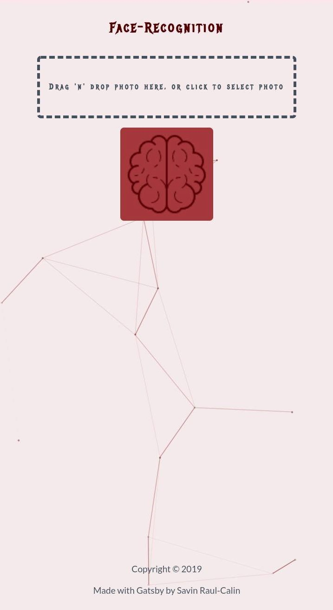
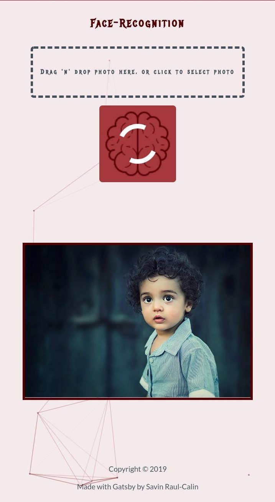
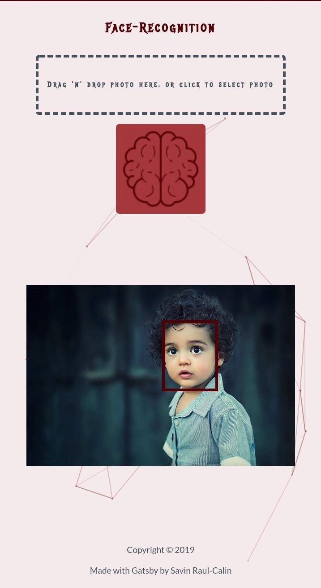
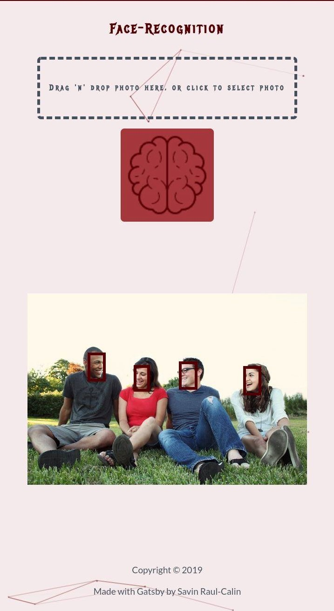

# Face-Recognition
This Magic Brain will detect faces in your pictures

## How it works 
Drag 'n' drop your photo here, or click to select photo

## Screenshots
| Face-Recognition App | Loading state | One face detected | Multiple faces detection |
|:----:|:----:|:----:|:----:|
| |  | | 

## Built With
-  "clarifai": "^2.9.1",
-  "classnames": "^2.2.6",
-  "dotenv": "^8.2.0",
-  "gatsby": "^2.18.12",
-  "gatsby-image": "^2.2.34",
-  "gatsby-plugin-manifest": "^2.2.31",
-  "gatsby-plugin-offline": "^3.0.27",
-  "gatsby-plugin-react-helmet": "^3.1.16",
-  "gatsby-plugin-sharp": "^2.3.5",
-  "gatsby-source-filesystem": "^2.1.40",
-  "gatsby-transformer-sharp": "^2.3.7",
-  "prop-types": "^15.7.2",
-  "react": "^16.12.0",
-  "react-dom": "^16.12.0",
-  "react-dropzone": "^10.2.1",
-  "react-helmet": "^5.2.1",
-  "react-particles-js": "^2.7.0",
-  "react-tilt": "^0.1.4"